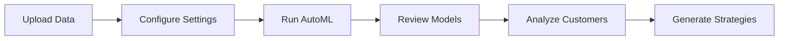

# Customer Churn Analysis Platform

[](https://www.python.org/downloads/)
[](https://streamlit.io)
[](https://opensource.org/licenses/MIT)

> An enterprise-grade Streamlit application for intelligent customer churn prediction, explainability, and retention strategy optimization.

## Overview

The Customer Churn Analysis Platform is a comprehensive, production-ready solution that combines AutoML model training, leakage-aware validation, unsupervised learning capabilities, RFM feature engineering, SHAP explainability, and AI-assisted retention strategies in a unified interface. Built for data science teams and business analysts, the platform automates the complete churn analytics lifecycle while maintaining professional validation standards.

## Table of Contents

- [Overview](#overview)
- [Key Features](#key-features)
- [Demo Dataset](#demo-dataset)
- [Architecture](#architecture)
- [Repository Structure](#repository-structure)
- [Getting Started](#getting-started)
  - [Prerequisites](#prerequisites)
  - [Installation](#installation)
  - [Configuration](#configuration)
  - [Running the Application](#running-the-application)
- [Data Requirements](#data-requirements)
- [User Workflow](#user-workflow)
- [Modeling Pipeline](#modeling-pipeline)
- [Explainability & Prescriptive Analytics](#explainability--prescriptive-analytics)
- [Testing](#testing)
- [Deployment](#deployment)
- [Documentation](#documentation)
- [Contributing](#contributing)
- [License](#license)
- [Author](#author)
- [Acknowledgments](#acknowledgments)

## Key Features

### 🎯 Advanced Modeling
- **AutoML Integration**: Automated model comparison and optimization using PyCaret
- **Supervised Learning**: State-of-the-art churn prediction with ensemble methods
- **Unsupervised Fallback**: Automatic churn label generation for unlabeled datasets
- **Universal RFM Engineering**: Flexible Recency-Frequency-Monetary feature extraction

### 🛡️ Professional Validation
- **Leakage Detection**: Automated data leakage identification and removal
- **Quality Assurance**: Comprehensive model validation and performance checks
- **Monitoring Agent**: Self-healing training pipeline with intelligent error recovery
- **Reliability Scoring**: Confidence metrics for model predictions

### 🔍 Explainability & Insights
- **SHAP Analysis**: Local feature importance for individual customer predictions
- **Counterfactual Generation**: DiCE-powered retention strategy recommendations
- **RFM Profiling**: Customer segmentation and behavior analysis
- **Visual Diagnostics**: Interactive charts and performance metrics

### 🤖 AI-Powered Actions
- **Smart Recommendations**: OpenAI-driven retention strategy suggestions
- **Promotional Content**: Automated marketing message generation
- **Cost-Benefit Analysis**: ROI-focused intervention planning
- **Action Prioritization**: Risk-based customer targeting

## Demo Dataset

The platform includes a pre-processed demonstration dataset for immediate testing:

| Attribute | Value |
|-----------|-------|
| **Filename** | `processed_churn_dataset.csv` |
| **Total Records** | 5,630 customers |
| **Features** | 24 columns |
| **Target Variable** | `Churn` (Binary) |
| **Class Distribution** | Retained: 4,682 (83.2%) / Churned: 948 (16.8%) |
| **Use Case** | Telecommunications customer retention |

## Architecture

The platform follows a modular, pipeline-based architecture orchestrated by [app.py](app.py):

### Core Pipeline Stages

1. **Data Ingestion** - Schema normalization and format validation
2. **Label Generation** - Optional unsupervised churn detection
3. **Feature Engineering** - RFM features and automated transformations
4. **Validation** - Leakage detection and quality safeguards
5. **Model Training** - PyCaret AutoML with monitoring and recovery
6. **Ensemble Creation** - Model stacking and blending optimization
7. **Prediction & Explanation** - SHAP analysis and counterfactual generation
8. **Action Planning** - AI-powered retention strategies

### Backend Modules

| Module | Purpose |
|--------|---------|
| [validation_engine.py](validation_engine.py) | Leakage detection, performance validation, report generation |
| [monitoring_agent.py](monitoring_agent.py) | Error classification, self-healing training retries |
| [unsupervised_churn.py](unsupervised_churn.py) | Churn label inference for unlabeled datasets |
| [universal_rfm.py](universal_rfm.py) | Universal RFM feature engineering framework |

## Repository Structure

```text
Customer-Churn-Analysis/
│
├── Core Application
│   ├── app.py                          # Main Streamlit application
│   ├── validation_engine.py            # Data validation and leakage detection
│   ├── monitoring_agent.py             # Training monitoring and recovery
│   ├── unsupervised_churn.py          # Unsupervised label generation
│   └── universal_rfm.py               # RFM feature engineering
│
├── Data & Models
│   ├── processed_churn_dataset.csv    # Demo dataset
│   ├── best_xgboost_model.json        # Pre-trained model artifacts
│   ├── automl_best_model.pkl          # Saved AutoML model
│   └── automl_model_columns.pkl       # Feature schema
│
├── Configuration
│   ├── requirements.txt               # Python dependencies
│   ├── Procfile.txt                   # Deployment configuration
│   ├── .streamlit/config.toml         # Streamlit settings
│   └── .env                           # Environment variables (create locally)
│
├── Testing Suite
│   ├── test_validation.py             # Validation engine tests
│   ├── test_monitoring_agent.py       # Monitoring agent tests
│   ├── test_unsupervised_churn.py     # Unsupervised mode tests
│   ├── test_reliability.py            # Reliability scoring tests
│   └── test_universal.py              # Universal RFM tests
│
└── Documentation
    ├── README.md                       # This file
    ├── QUICK_START.md                 # Quick start guide
    ├── PROFESSIONAL_VALIDATION_GUIDE.md
    ├── MONITORING_AGENT_GUIDE.md
    ├── UNSUPERVISED_MODE_GUIDE.md
    ├── RFM_INTEGRATION_GUIDE.md
    ├── DASHBOARD_CHANGES_SUMMARY.md
    └── IMPLEMENTATION_SUMMARY.md
```

## Getting Started

### Prerequisites

| Requirement | Version | Notes |
|------------|---------|-------|
| **Python** | 3.10+ | Required for compatibility |
| **pip** | Latest | Package manager |
| **Virtual Environment** | Recommended | Isolation and dependency management |
| **Git** | Any | For cloning repository |

### Installation

#### Step 1: Clone the Repository

```bash
git clone https://github.com/yourusername/customer-churn-analysis.git
cd customer-churn-analysis
```

#### Step 2: Create Virtual Environment

**macOS/Linux:**
```bash
python3 -m venv .venv
source .venv/bin/activate
```

**Windows:**
```cmd
python -m venv .venv
.venv\Scripts\activate
```

#### Step 3: Install Dependencies

```bash
pip install --upgrade pip
pip install -r requirements.txt
```

**Note:** Initial installation may take several minutes due to large dependencies (PyCaret, scikit-learn, XGBoost, etc.)

### Configuration

#### Environment Variables

Create a `.env` file in the project root:

```env
# Required for AI-powered features (Optional)
OPENAI_API_KEY=your_openai_api_key_here

# Optional configurations
STREAMLIT_SERVER_PORT=8501
STREAMLIT_SERVER_ADDRESS=localhost
```

**Important Notes:**
- OpenAI features are **optional** - the application functions fully without an API key
- AI recommendation and promotional content generation require a valid OpenAI API key
- Keep your `.env` file secure and never commit it to version control

### Running the Application

#### Local Development

```bash
streamlit run app.py
```

The application will launch at: **http://localhost:8501**

#### Custom Port

```bash
streamlit run app.py --server.port 8080
```

#### Production Mode

```bash
streamlit run app.py --server.port $PORT --server.address 0.0.0.0 --server.enableCORS false --server.enableXsrfProtection false
```

## Data Requirements

### Input Format

| Requirement | Description |
|------------|-------------|
| **File Type** | CSV (`.csv`) |
| **Header Row** | Required |
| **Data Types** | Numeric, categorical, boolean, datetime supported |
| **Encoding** | UTF-8 recommended |
| **Size Limit** | Recommended < 100MB for optimal performance |

### Target Column (Supervised Mode)

The application automatically detects and normalizes binary churn targets:

**Positive Class (Churned):**
- Numeric: `1`
- Text: `yes`, `true`, `churn`, `churned`, `left`, `exited`, `departed`

**Negative Class (Retained):**
- Numeric: `0`
- Text: `no`, `false`, `stay`, `stayed`, `retained`, `active`

**Note:** Case-insensitive matching is applied automatically

### Customer ID Column

- **Optional but recommended** for row-level customer analysis
- ID-like columns are automatically excluded from training to prevent leakage
- Common patterns detected: `id`, `customer_id`, `user_id`, `account_id`

### Unsupervised Mode

If no churn column is detected, the platform can generate synthetic labels using:

| Method | Description | Best For |
|--------|-------------|----------|
| **Auto** | Intelligent method selection | Recommended for most cases |
| **Behavioral Heuristics** | Rule-based scoring | Clear behavioral signals |
| **Clustering** | K-means segmentation | Natural customer groups |
| **Anomaly Detection** | Isolation Forest | Identifying outliers |

Each method includes reliability metrics and confidence scores displayed in the application.

## User Workflow

### Step-by-Step Guide



1. **Data Upload**
   - Upload your CSV file or use the demo dataset
   - Review data preview and statistics

2. **Configuration**
   - Select target column (churn indicator)
   - Choose customer ID column (optional)
   - Enable unsupervised mode if needed

3. **Model Training**
   - Click "Run AutoML" to start training
   - Monitor progress and validation checks
   - View automated leakage detection results

4. **Model Review**
   - Examine model comparison metrics
   - Review performance diagnostics
   - Analyze feature importance

5. **Customer Analysis**
   - Select individual customers for deep-dive
   - View SHAP explanations
   - Examine RFM profile

6. **Action Planning**
   - Generate counterfactual strategies
   - Review AI-powered recommendations
   - Create promotional messaging

### Tips for Best Results

- **Data Quality**: Clean data produces better models - handle missing values appropriately
- **Feature Engineering**: Let the platform generate RFM features automatically
- **Validation**: Review leakage warnings carefully before deploying models
- **Thresholds**: Adjust prediction thresholds based on your business costs
- **Testing**: Use the demo dataset first to understand the workflow

## Modeling Pipeline

### Quality Assurance Framework

The platform implements a comprehensive validation pipeline to ensure model reliability:

#### Phase 1: Pre-Processing
1. **Column Sanitization** - Standardize naming and formats
2. **Target Normalization** - Consistent binary encoding
3. **Feature Filtering** - Remove high-missing and constant columns
4. **Fast Leakage Screening** - Identify suspicious correlations

#### Phase 2: Feature Engineering
5. **Universal RFM Generation** - Automatic Recency, Frequency, Monetary calculations
6. **Type Inference** - Smart feature type detection
7. **Encoding Strategy** - Optimal categorical handling

#### Phase 3: Advanced Validation
8. **Professional Validation Engine** (`ChurnValidationEngine`)
   - Deep leakage detection algorithms
   - Data quality assessments
   - Model performance validation
   - Comprehensive reporting

#### Phase 4: Training & Monitoring
9. **Monitored PyCaret Training** (`MonitoringAgent`)
   - Real-time error classification
   - Automatic retry with fixes
   - Self-healing capabilities
   - Performance tracking

#### Phase 5: Ensemble & Optimization
10. **Ensemble Creation** - Stacking and blending strategies
11. **Threshold Optimization** - Business-driven cutoff selection
12. **Post-Training Validation** - Overfitting checks and diagnostics

### Model Quality Metrics

The platform evaluates models across multiple dimensions:

| Metric | Purpose | Threshold |
|--------|---------|-----------|
| **AUC-ROC** | Overall discrimination | > 0.70 |
| **Precision** | Positive prediction accuracy | Business-dependent |
| **Recall** | True positive capture rate | Business-dependent |
| **F1-Score** | Balanced performance | > 0.60 |
| **Calibration** | Probability reliability | Brier Score < 0.15 |

### Leakage Prevention

Automated detection and removal of:
- **Perfect Predictors**: Features with near-perfect correlation to target
- **Target Encoding Artifacts**: Information bleeding from target
- **Temporal Leakage**: Future information in historical data
- **Identifier Leakage**: ID-like features in training

## Explainability & Prescriptive Analytics

### SHAP (SHapley Additive exPlanations)

Understanding individual predictions through game-theory-based feature attribution:

- **Local Explanations**: Feature contributions for specific customer predictions
- **Feature Impact**: Positive or negative influence on churn probability
- **Visual Waterfall Charts**: Intuitive explanation visualizations
- **Global Importance**: Overall feature ranking across all predictions

### Counterfactual Analysis (DiCE)

Generate actionable retention strategies through "what-if" scenarios:

**Features:**
- **Diverse Counterfactuals**: Multiple alternative scenarios for the same customer
- **Feasibility Constraints**: Realistic and actionable recommendations
- **Proximity Optimization**: Minimal changes to achieve desired outcome
- **Cost-Benefit Framing**: ROI-focused intervention planning

**Example Output:**
```
Original Churn Risk: 78%

Suggested Actions:
1. Increase contract length to 12 months → Reduces risk to 23%
2. Add streaming service bundle → Reduces risk to 31%
3. Upgrade to fiber optic internet → Reduces risk to 28%

Estimated intervention cost: $50-120 per customer
Expected CLV improvement: $450-600
```

### RFM Segmentation

Automated customer profiling based on behavioral patterns:

| Metric | Description | Business Value |
|--------|-------------|----------------|
| **Recency** | Days since last activity | Engagement timing |
| **Frequency** | Number of transactions | Usage intensity |
| **Monetary** | Total revenue value | Customer worth |

**Segment Examples:**
- Champions: High F, High M, Low R
- At-Risk: High F, High M, High R
- New Customers: Low F, Low M, Low R

### AI-Powered Recommendations (OpenAI)

When configured, the platform generates:

1. **Retention Strategies**: Customized action plans per customer segment
2. **Business Rules**: If-then logic for automated interventions
3. **Promotional Messages**: Marketing copy tailored to customer profile
4. **Priority Ranking**: Risk-adjusted customer targeting lists

**Privacy Note:** Customer data is processed locally; only anonymized patterns are sent to OpenAI when generating recommendations.

## Testing

### Comprehensive Test Suite

The platform includes extensive tests for all critical components:

#### Running All Tests

```bash
# Run complete test suite
python test_validation.py
python test_monitoring_agent.py
python test_unsupervised_churn.py
python test_reliability.py
python test_universal.py
```

#### Test Coverage

| Test Module | Coverage Area | Key Validations |
|-------------|---------------|-----------------|
| **test_validation.py** | Validation engine functionality | Leakage detection accuracy, model validation flow, report generation |
| **test_monitoring_agent.py** | Training monitoring system | Error classification, fix strategies, retry logic |
| **test_unsupervised_churn.py** | Label generation methods | Algorithm correctness, reliability scoring, edge cases |
| **test_reliability.py** | Confidence metrics | Score calibration, boundary conditions, consistency |
| **test_universal.py** | RFM feature engineering | Cross-dataset compatibility, column detection, calculation accuracy |

#### Continuous Integration

For CI/CD pipelines, create a test runner:

```bash
#!/bin/bash
# run_all_tests.sh

echo "Running validation tests..."
python test_validation.py || exit 1

echo "Running monitoring tests..."
python test_monitoring_agent.py || exit 1

echo "Running unsupervised tests..."
python test_unsupervised_churn.py || exit 1

echo "Running reliability tests..."
python test_reliability.py || exit 1

echo "Running universal RFM tests..."
python test_universal.py || exit 1

echo "All tests passed!"
```

Make executable and run:
```bash
chmod +x run_all_tests.sh
./run_all_tests.sh
```

## Deployment

### Platform Support

The application is deployment-ready for multiple cloud platforms:

#### DigitalOcean App Platform

**Configuration:** [Procfile.txt](Procfile.txt)
```
web: streamlit run app.py --server.port $PORT --server.address 0.0.0.0 --server.enableCORS false --server.enableXsrfProtection false
```

**Deployment Steps:**
1. Create new App from GitHub repository
2. Set environment variables in App settings
3. Configure `PORT` variable (auto-injected by platform)
4. Deploy from main branch

#### Heroku

```bash
# Login to Heroku
heroku login

# Create new app
heroku create your-app-name

# Set environment variables
heroku config:set OPENAI_API_KEY=your_key_here

# Deploy
git push heroku main
```

#### Streamlit Cloud

1. Connect GitHub repository to Streamlit Cloud
2. Select [app.py](app.py) as main file
3. Add secrets in Streamlit Cloud dashboard:
   ```toml
   OPENAI_API_KEY = "your_key_here"
   ```
4. Deploy automatically on commit

#### Docker

Create `Dockerfile`:
```dockerfile
FROM python:3.10-slim

WORKDIR /app

COPY requirements.txt .
RUN pip install --no-cache-dir -r requirements.txt

COPY . .

EXPOSE 8501

CMD ["streamlit", "run", "app.py", "--server.port=8501", "--server.address=0.0.0.0"]
```

Build and run:
```bash
docker build -t churn-analysis .
docker run -p 8501:8501 -e OPENAI_API_KEY=your_key churn-analysis
```

### Pre-Deployment Checklist

- [ ] Install all dependencies from [requirements.txt](requirements.txt)
- [ ] Configure `OPENAI_API_KEY` in platform secrets (optional)
- [ ] Ensure `PORT` environment variable is available
- [ ] Test with demo dataset before production deployment
- [ ] Review memory requirements (recommend 2GB+ RAM)
- [ ] Configure logging and error tracking
- [ ] Set up database for model artifact storage (optional)
- [ ] Enable HTTPS for production environments
- [ ] Configure rate limiting for API endpoints

### Performance Optimization

**For Production Deployments:**

1. **Model Artifacts**: Store trained models in cloud storage (S3, GCS) instead of repository
2. **Caching**: Enable Streamlit caching for expensive operations
3. **Scaling**: Use load balancer for high-traffic scenarios
4. **Monitoring**: Integrate application performance monitoring (APM)
5. **Resources**: Allocate sufficient memory for large datasets (4GB+ recommended)

### Security Considerations

- Keep `.env` and sensitive files out of version control (add to `.gitignore`)
- Use environment variables for all API keys and credentials
- Enable CORS protection in production
- Implement authentication for multi-user deployments
- Regular dependency updates for security patches
- Data encryption for customer information

## Documentation

### Complete Documentation Suite

Comprehensive guides are available for all platform features:

| Document | Description | Audience |
|----------|-------------|----------|
| [QUICK_START.md](QUICK_START.md) | Fast-track setup and first run | New users |
| [PROFESSIONAL_VALIDATION_GUIDE.md](PROFESSIONAL_VALIDATION_GUIDE.md) | Leakage detection and validation best practices | Data scientists |
| [MONITORING_AGENT_GUIDE.md](MONITORING_AGENT_GUIDE.md) | Training monitoring and error recovery | ML engineers |
| [UNSUPERVISED_MODE_GUIDE.md](UNSUPERVISED_MODE_GUIDE.md) | Label generation for unlabeled datasets | Analysts |
| [RFM_INTEGRATION_GUIDE.md](RFM_INTEGRATION_GUIDE.md) | RFM feature engineering details | Business analysts |
| [DASHBOARD_CHANGES_SUMMARY.md](DASHBOARD_CHANGES_SUMMARY.md) | UI updates and feature changelog | All users |
| [IMPLEMENTATION_SUMMARY.md](IMPLEMENTATION_SUMMARY.md) | Technical architecture overview | Developers |

### Additional Resources

- **Code Documentation**: Inline docstrings throughout codebase
- **Type Hints**: Full type annotations for better IDE support
- **Example Notebooks**: [customer_churn_analysis.ipynb](customer_churn_analysis.ipynb) for exploratory analysis
- **API Reference**: Module-level documentation in source files

## Contributing

Contributions are welcome! Please follow these guidelines:

### How to Contribute

1. **Fork the repository**
2. **Create a feature branch**: `git checkout -b feature/amazing-feature`
3. **Make your changes**: Follow code style and conventions
4. **Add tests**: Ensure new features have test coverage
5. **Commit changes**: `git commit -m 'Add amazing feature'`
6. **Push to branch**: `git push origin feature/amazing-feature`
7. **Open Pull Request**: Describe changes and motivation

### Development Guidelines

- **Code Style**: Follow PEP 8 for Python code
- **Type Hints**: Add type annotations to all functions
- **Documentation**: Update relevant docs and docstrings
- **Testing**: Write tests for new functionality
- **Commits**: Use clear, descriptive commit messages

### Reporting Issues

Found a bug? Have a feature request?

1. Check existing issues first
2. Create detailed issue with:
   - Clear title and description
   - Steps to reproduce (for bugs)
   - Expected vs actual behavior
   - Environment details (OS, Python version)
   - Screenshots if applicable

## License

This project is licensed under the **MIT License** - see below for details:

```
MIT License

Copyright (c) 2026 Rasel Mia

Permission is hereby granted, free of charge, to any person obtaining a copy
of this software and associated documentation files (the "Software"), to deal
in the Software without restriction, including without limitation the rights
to use, copy, modify, merge, publish, distribute, sublicense, and/or sell
copies of the Software, and to permit persons to whom the Software is
furnished to do so, subject to the following conditions:

The above copyright notice and this permission notice shall be included in all
copies or substantial portions of the Software.

THE SOFTWARE IS PROVIDED "AS IS", WITHOUT WARRANTY OF ANY KIND, EXPRESS OR
IMPLIED, INCLUDING BUT NOT LIMITED TO THE WARRANTIES OF MERCHANTABILITY,
FITNESS FOR A PARTICULAR PURPOSE AND NONINFRINGEMENT. IN NO EVENT SHALL THE
AUTHORS OR COPYRIGHT HOLDERS BE LIABLE FOR ANY CLAIM, DAMAGES OR OTHER
LIABILITY, WHETHER IN AN ACTION OF CONTRACT, TORT OR OTHERWISE, ARISING FROM,
OUT OF OR IN CONNECTION WITH THE SOFTWARE OR THE USE OR OTHER DEALINGS IN THE
SOFTWARE.
```

## Author

**Rasel Mia**  
MSc Business Intelligence  
Aarhus University

## Acknowledgments

This project leverages several outstanding open-source libraries and frameworks:

### Core Technologies
- **[Streamlit](https://streamlit.io/)** - Interactive web application framework
- **[PyCaret](https://pycaret.org/)** - Low-code machine learning library
- **[SHAP](https://github.com/slundberg/shap)** - Model explainability framework
- **[DiCE](https://github.com/interpretml/DiCE)** - Counterfactual explanations

### Machine Learning Stack
- **[scikit-learn](https://scikit-learn.org/)** - Machine learning fundamentals
- **[XGBoost](https://xgboost.readthedocs.io/)** - Gradient boosting implementation
- **[CatBoost](https://catboost.ai/)** - Categorical feature handling
- **[LightGBM](https://lightgbm.readthedocs.io/)** - Fast gradient boosting

### Data Processing
- **[Pandas](https://pandas.pydata.org/)** - Data manipulation and analysis
- **[NumPy](https://numpy.org/)** - Numerical computing
- **[Plotly](https://plotly.com/)** - Interactive visualizations

### AI Integration
- **[OpenAI](https://openai.com/)** - AI-powered recommendations (optional)

---

*Last Updated: February 2026*

